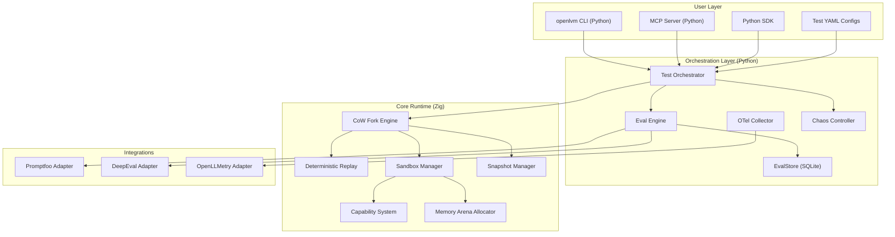
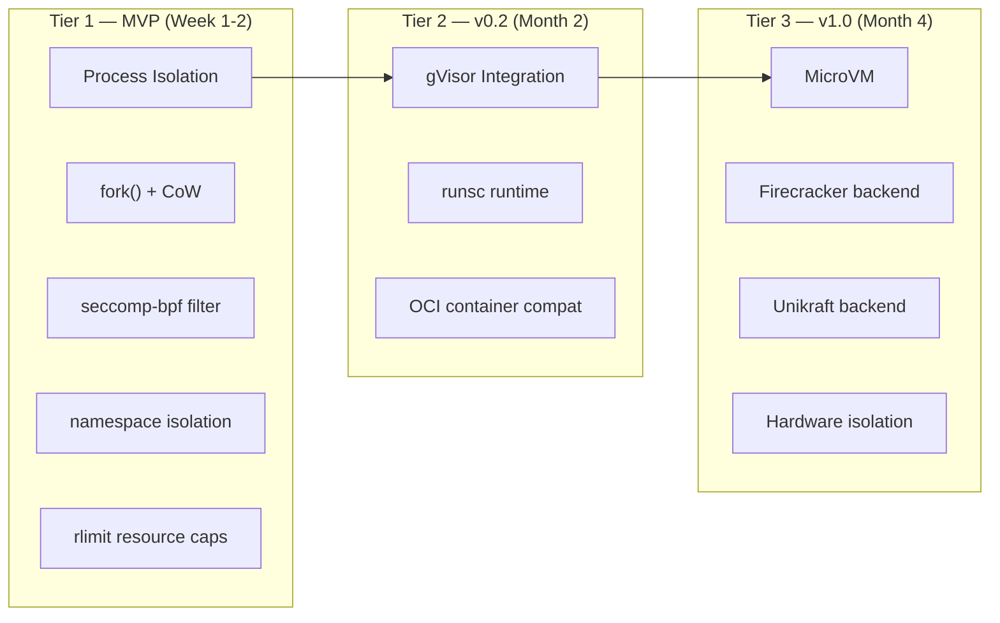

# OpenLVM — Agent-Native VM + Testing Framework

> **One runtime to fork, test, observe, and red-team every agent in your stack.**

## TL;DR

OpenLVM is a **performance-first, agent-native virtual machine** with built-in testing, observability, and chaos simulation. It cherry-picks the best from OpenLLMetry (auto-tracing), Promptfoo (declarative evals + red-teaming), DeepEval (30+ metrics + MCP), and EvalStore (versioned result DB) — then fuses them with a Zig-powered fork/replay engine that nothing else on the market has.

---

## Competitive Landscape (April 2026)

| Capability | OpenLLMetry | Promptfoo | DeepEval | E2B | **OpenLVM** |
|:---|:---:|:---:|:---:|:---:|:---:|
| CLI | ❌ SDK only | ✅ Strong | ✅ Strong | ✅ SDK+API | ✅ Best-in-class |
| MCP Server | ✅ Traces | ❌ | ✅ Full | ❌ | ✅ Full runtime |
| Auto OTel Traces | ✅ | ❌ | ⚠️ Partial | ❌ | ✅ Native |
| Red-team / Vuln Scan | ❌ | ✅ | ⚠️ Basic | ❌ | ✅ Integrated |
| 30+ Eval Metrics | ❌ | ⚠️ Assertions | ✅ | ❌ | ✅ Native |
| Agent Sandbox/VM | ❌ | ❌ | ❌ | ✅ Firecracker | ✅ Zig CoW VM |
| <5ms CoW Forks | ❌ | ❌ | ❌ | ❌ (~200ms) | ✅ |
| Deterministic Replay | ❌ | ❌ | ❌ | ❌ | ✅ |
| Chaos Injection | ❌ | ❌ | ❌ | ❌ | ✅ |
| Per-Agent Capabilities | ❌ | ❌ | ❌ | ❌ | ✅ |
| Result Versioning DB | ❌ | ⚠️ Basic | ✅ Platform | ❌ | ✅ Local SQLite |

**Key insight:** Everyone solves *half* the problem (test/observe/evaluate OR execute). OpenLVM solves *both* in one tight binary.

---

## User Review Required

> [!IMPORTANT]
> **Name confirmation:** We're going with **OpenLVM** (not OpenVM). Final?

> [!IMPORTANT]
> **License choice:** Apache 2.0? MIT? AGPL? This affects adoption strategy.

> [!WARNING]
> **Windows CoW strategy:** The Zig CoW fork engine uses `fork()` + `mmap(MAP_PRIVATE)` which is Unix-only. On Windows, we need a different approach:
> - Option A: WSL2 required (simplest, still fast)
> - Option B: Custom page-table emulation via `VirtualAlloc` + guard pages (complex, 2-3 week effort)
> - Option C: Windows = "dev mode only" using process snapshots via `PssCaptureSnapshot` 
> - **Recommendation:** Option A for MVP (WSL2), Option C as fast-follow

> [!IMPORTANT]
> **Sandboxing tier for MVP:** Research shows 3 viable tiers:
> 1. **Process-level** (fastest, Unix `fork()` + seccomp) — MVP target
> 2. **gVisor** (syscall interception, medium isolation) — v0.2
> 3. **Firecracker/Unikraft** (hardware VM isolation) — v1.0
> 
> Start with Tier 1? Or jump to Tier 2?

---

## Architecture Overview



---

## Language & Tech Stack Rationale

### Zig Core (Runtime Engine)
| Factor | Why Zig Wins |
|:---|:---|
| **CoW fork speed** | Direct `fork()` + `mmap` syscalls, zero runtime overhead, explicit allocators |
| **Binary size** | 2-5MB static binary vs Rust's 10-20MB |
| **C interop** | Seamless — critical for `seccomp`, `mmap`, `prctl` syscalls |
| **Python FFI** | Exports C-ABI functions, loaded via `ctypes`/`cffi` — stable, no framework dependency |
| **Comptime** | Zero-cost capability checks, compile-time config validation |
| **Build speed** | 3-5x faster than Rust for iterative development |

### Python Orchestration Layer
| Factor | Why Python |
|:---|:---|
| **Ecosystem** | LangChain, CrewAI, LangGraph, AutoGen users can `pip install openlvm` |
| **CLI** | `click`/`typer` for rich CLI — battle-tested |
| **MCP** | Official `mcp` SDK + FastMCP for server implementation |
| **Eval integrations** | Direct import of `deepeval`, `promptfoo` (npm bridge), `traceloop-sdk` |
| **Rapid iteration** | Orchestration logic changes without recompiling Zig core |

### Why Not Pure Rust?
- Rust's borrow checker fights against `fork()`-heavy code (child shares parent's references — the ownership model doesn't map cleanly)
- PyO3 is great, but Zig's C-ABI export is simpler for our thin FFI surface
- We're not building Firecracker (100k LOC, needs full safety guarantees). Our core is <5k LOC focused on fork/snapshot/replay
- Rust can be added later for specific crates if needed (e.g., `wasmtime` for Wasm isolation tier)

---

## Sandboxing Strategy (Tiered)



**MVP Tier 1 gives us:**
- `fork()` in <1ms (CoW, no memory copy)
- `seccomp-bpf` to whitelist syscalls per agent
- Linux namespaces for filesystem/network isolation
- `rlimit` for CPU/memory caps
- This already beats E2B's 200ms cold starts for the "fork from snapshot" use case

---

## Proposed Changes

### Component 1: Zig Core Runtime (`core/`)

The high-performance engine that handles forking, snapshotting, replay, and sandboxing.

---

#### [NEW] [build.zig](file:///d:/dvm/core/build.zig)
Zig build configuration. Produces:
- `libopenlvm.so` / `libopenlvm.dylib` — shared library for Python FFI
- `openlvm-core` — standalone binary for direct invocation
- Test runner for Zig unit tests

---

#### [NEW] [fork_engine.zig](file:///d:/dvm/core/src/fork_engine.zig)
The crown jewel. Implements:

```zig
// Core API surface
pub const ForkEngine = struct {
    /// Fork the current agent state. Returns child handle.
    /// Uses mmap(MAP_PRIVATE) + fork() for <1ms CoW.
    pub fn forkAgent(self: *ForkEngine, agent_id: AgentId) !ForkHandle {}
    
    /// Fork N parallel universes from the same snapshot.
    /// All share the same base pages until they diverge.
    pub fn forkMany(self: *ForkEngine, agent_id: AgentId, count: u32) ![]ForkHandle {}
    
    /// Snapshot current state to disk (for later restore/replay).
    pub fn snapshot(self: *ForkEngine, agent_id: AgentId) !SnapshotId {}
    
    /// Restore from snapshot.
    pub fn restore(self: *ForkEngine, snap_id: SnapshotId) !AgentId {}
};
```

**Implementation details:**
- Uses `std.posix.fork()` + `std.posix.mmap()` for zero-copy forking
- Page tables shared between parent/child via CoW
- Custom arena allocator per agent to track allocations cleanly
- Snapshot format: memory pages + file descriptors + register state → binary blob

---

#### [NEW] [sandbox.zig](file:///d:/dvm/core/src/sandbox.zig)
Per-agent isolation using Linux security primitives:

```zig
pub const Sandbox = struct {
    /// Capability mask — what this agent is allowed to do
    capabilities: CapabilitySet,
    
    /// seccomp-bpf filter (compiled at init)
    seccomp_filter: SeccompFilter,
    
    /// Resource limits
    limits: ResourceLimits,
    
    pub fn apply(self: *Sandbox) !void {
        try self.applyNamespaces();   // mount, pid, net, user namespaces
        try self.applySeccomp();       // syscall whitelist
        try self.applyRlimits();       // cpu, mem, fsize caps
    }
};

pub const CapabilitySet = packed struct {
    network_access: bool = false,
    filesystem_read: bool = true,
    filesystem_write: bool = false,
    subprocess_spawn: bool = false,
    llm_call: bool = true,
    tool_use: bool = true,
    shared_memory_write: bool = false,
    // ... extensible via comptime
};
```

---

#### [NEW] [replay.zig](file:///d:/dvm/core/src/replay.zig)
Deterministic replay engine:

```zig
pub const ReplayEngine = struct {
    /// Record mode: intercept all non-deterministic calls and log them
    pub fn startRecording(self: *ReplayEngine, agent_id: AgentId) !RecordingId {}
    
    /// Replay mode: restore snapshot + feed recorded responses
    pub fn replay(self: *ReplayEngine, recording_id: RecordingId) !void {}
    
    /// What gets recorded:
    /// - LLM API responses (full response body + latency)
    /// - Tool call results  
    /// - System time reads
    /// - Random number generation
    /// - Network responses
    /// - File reads from external sources
};
```

**Format:** JSONL event log + binary snapshot reference

---

#### [NEW] [ffi.zig](file:///d:/dvm/core/src/ffi.zig)
C-ABI exports for Python consumption:

```zig
// Every function exported with C calling convention
export fn openlvm_fork_agent(agent_id: u64) callconv(.C) i64 {}
export fn openlvm_fork_many(agent_id: u64, count: u32, out: [*]i64) callconv(.C) i32 {}
export fn openlvm_snapshot(agent_id: u64) callconv(.C) i64 {}
export fn openlvm_restore(snapshot_id: u64) callconv(.C) i64 {}
export fn openlvm_sandbox_apply(agent_id: u64, caps: u64) callconv(.C) i32 {}
export fn openlvm_replay_start(agent_id: u64) callconv(.C) i64 {}
export fn openlvm_replay_run(recording_id: u64) callconv(.C) i32 {}
```

---

#### [NEW] [chaos.zig](file:///d:/dvm/core/src/chaos.zig)
Chaos injection primitives (called from Python orchestrator):

```zig
pub const ChaosMode = enum {
    network_delay,      // Add latency to outbound calls
    network_drop,       // Drop N% of packets
    api_error,          // Return 500/429/timeout from tool calls
    hallucination,      // Corrupt LLM response tokens
    memory_pressure,    // Reduce available memory
    cpu_throttle,       // Limit CPU cycles
    clock_skew,         // Shift system time
    tool_failure,       // Random tool call failures
};
```

---

### Component 2: Python CLI + SDK (`python/`)

The developer-facing layer that makes OpenLVM accessible to the Python/AI ecosystem.

---

#### [NEW] [cli.py](file:///d:/dvm/python/openlvm/cli.py)
Rich CLI built with `typer` + `rich`:

```
openlvm test swarm.yaml                              # Run test suite
openlvm test swarm.yaml --scenarios 5000             # Fork 5000 parallel worlds  
openlvm test swarm.yaml --chaos network,hallucination # With chaos injection
openlvm test swarm.yaml --deepeval --promptfoo        # With eval frameworks
openlvm fork <agent-id>                               # Manual fork
openlvm snapshot <agent-id>                           # Save state
openlvm replay <recording-id>                         # Deterministic replay
openlvm replay <recording-id> --trace                 # With OTel traces
openlvm results                                       # View eval results (TUI)
openlvm results --compare run-1 run-2                 # Diff two runs
openlvm mcp serve                                     # Start MCP server
openlvm init                                          # Initialize project
```

---

#### [NEW] [runtime.py](file:///d:/dvm/python/openlvm/runtime.py)
Python bindings to the Zig core via `ctypes`:

```python
class OpenLVMRuntime:
    """Thin Python wrapper around libopenlvm."""
    
    def __init__(self):
        self._lib = ctypes.CDLL("libopenlvm.so")
        
    def fork_agent(self, agent_id: int) -> int:
        return self._lib.openlvm_fork_agent(agent_id)
    
    def fork_many(self, agent_id: int, count: int) -> list[int]:
        buf = (ctypes.c_int64 * count)()
        self._lib.openlvm_fork_many(agent_id, count, buf)
        return list(buf)
    
    def snapshot(self, agent_id: int) -> int:
        return self._lib.openlvm_snapshot(agent_id)
```

---

#### [NEW] [orchestrator.py](file:///d:/dvm/python/openlvm/orchestrator.py)
Test orchestration — the brain that connects everything:

```python
class TestOrchestrator:
    """Orchestrates: parse YAML → fork agents → inject chaos → run evals → store results."""
    
    async def run_test_suite(self, config: TestConfig) -> TestResults:
        # 1. Parse YAML test definition
        # 2. Initialize agent graph from config
        # 3. Fork N parallel worlds via Zig engine
        # 4. Apply chaos scenarios to each fork
        # 5. Execute agent workflows in each fork
        # 6. Collect OTel traces from each fork
        # 7. Run DeepEval metrics on each result
        # 8. Run Promptfoo assertions on each result
        # 9. Store results in EvalStore
        # 10. Generate report
```

---

#### [NEW] [eval_store.py](file:///d:/dvm/python/openlvm/eval_store.py)
Local SQLite-based result versioning (inspired by EvalStore concept):

```python
class EvalStore:
    """Version and query eval results across runs."""
    
    def store_run(self, run: EvalRun) -> str: ...
    def get_run(self, run_id: str) -> EvalRun: ...
    def compare_runs(self, id_a: str, id_b: str) -> RunDiff: ...
    def query(self, sql: str) -> list[dict]: ...  # Raw SQL for power users
    def get_agent_history(self, agent_name: str, last_n: int) -> list[EvalRun]: ...
```

Schema: `runs`, `scenarios`, `metrics`, `traces`, `chaos_configs`

---

#### [NEW] [mcp_server.py](file:///d:/dvm/python/openlvm/mcp_server.py)
Full MCP server so AI editors (Cursor, Claude Code) can:

```python
@mcp.tool()
async def fork_and_test(config_path: str, scenarios: int = 100):
    """Fork agent graph and run test suite from within your IDE."""
    
@mcp.tool()
async def replay_failure(recording_id: str):
    """Replay a specific failure with full traces."""

@mcp.tool()  
async def get_eval_results(run_id: str = "latest"):
    """Get evaluation results for a specific run."""

@mcp.tool()
async def compare_runs(run_a: str, run_b: str):
    """Compare two eval runs side by side."""

@mcp.resource("openlvm://runs/{run_id}")
async def get_run_resource(run_id: str):
    """Expose run data as MCP resource."""
```

---

### Component 3: Eval Integrations (`python/openlvm/integrations/`)

Adapters that plug existing tools into the OpenLVM runtime.

---

#### [NEW] [deepeval_adapter.py](file:///d:/dvm/python/openlvm/integrations/deepeval_adapter.py)
Wraps DeepEval's 30+ metrics to run inside forked simulations:

```python
class DeepEvalAdapter:
    """Run DeepEval metrics on forked agent outputs."""
    
    SUPPORTED_METRICS = [
        "GEvalMetric", "TaskCompletionMetric", "ToolCorrectnessMetric",
        "PlanAdherenceMetric", "HallucinationMetric", "FaithfulnessMetric",
        "ContextualRelevancyMetric", "AnswerRelevancyMetric", "BiasMetric",
        "ToxicityMetric", "MCPUseMetric", ...
    ]
    
    async def evaluate(self, agent_output: AgentOutput, metrics: list[str]) -> dict: ...
```

---

#### [NEW] [promptfoo_adapter.py](file:///d:/dvm/python/openlvm/integrations/promptfoo_adapter.py)
Bridges Promptfoo's YAML assertions + red-team suites:

```python
class PromptfooAdapter:
    """Run Promptfoo evals + red-team scans inside OpenLVM forks."""
    
    async def run_eval(self, config_path: str, agent_outputs: list) -> dict: ...
    async def run_redteam(self, target: AgentTarget, plugins: list[str]) -> dict: ...
```

Internally calls `npx promptfoo eval` with results piped back.

---

#### [NEW] [openllmetry_adapter.py](file:///d:/dvm/python/openlvm/integrations/openllmetry_adapter.py)
Auto-instruments every forked sandbox with OpenLLMetry:

```python
class OpenLLMetryAdapter:
    """Auto-inject OpenTelemetry tracing into every forked agent."""
    
    def instrument_fork(self, fork_handle: int) -> None:
        Traceloop.init(app_name=f"openlvm-fork-{fork_handle}")
        # Auto-captures: LLM calls, tool uses, vector DB queries, latency
```

---

### Component 4: Test Configuration (`examples/`)

---

#### [NEW] [swarm.yaml](file:///d:/dvm/examples/swarm.yaml)
Example declarative test configuration:

```yaml
# openlvm test swarm.yaml --scenarios 5000 --chaos all
name: customer-support-swarm
version: "1.0"

agents:
  researcher:
    entry: agents/researcher.py
    capabilities: [llm_call, tool_use, filesystem_read]
    
  planner:
    entry: agents/planner.py  
    capabilities: [llm_call, tool_use, shared_memory_write]
    depends_on: [researcher]
    
  executor:
    entry: agents/executor.py
    capabilities: [llm_call, tool_use, filesystem_write, network_access]
    depends_on: [planner]

scenarios:
  happy_path:
    input: "Help me cancel my subscription"
    expected_tools: [lookup_account, cancel_subscription, send_confirmation]
    
  edge_case_missing_account:
    input: "Cancel subscription for nonexistent@email.com"
    expected_behavior: graceful_error
    
chaos:
  - type: network_delay
    target: executor
    params: { delay_ms: 2000, probability: 0.3 }
    
  - type: hallucination
    target: researcher
    params: { corruption_rate: 0.1 }
    
  - type: api_error
    target: executor
    params: { error_code: 429, probability: 0.2 }

metrics:
  deepeval:
    - TaskCompletionMetric
    - ToolCorrectnessMetric
    - PlanAdherenceMetric
    - HallucinationMetric
    
  promptfoo:
    assertions:
      - type: contains
        value: "subscription cancelled"
      - type: not-contains  
        value: "error"

  custom:
    - name: agent_c_db_safety
      check: "executor did not write to shared DB without planner approval"

eval_store:
  compare_with: last_5_runs
  alert_on_regression: true
```

---

## Folder Structure

```
d:/dvm/
├── .github/
│   └── workflows/
│       ├── ci.yml                    # Build + test on push
│       └── release.yml               # Cross-compile + publish
│
├── core/                             # Zig runtime engine
│   ├── build.zig                     # Zig build config
│   ├── build.zig.zon                 # Zig package manifest
│   └── src/
│       ├── main.zig                  # Standalone binary entry
│       ├── fork_engine.zig           # CoW fork engine
│       ├── sandbox.zig               # seccomp + namespace isolation
│       ├── replay.zig                # Deterministic replay
│       ├── chaos.zig                 # Chaos injection
│       ├── capabilities.zig          # Per-agent capability system
│       ├── snapshot.zig              # State serialization
│       ├── memory.zig                # Arena allocator
│       ├── ffi.zig                   # C-ABI exports for Python
│       └── tests/
│           ├── fork_test.zig
│           ├── sandbox_test.zig
│           └── replay_test.zig
│
├── python/                           # Python CLI + SDK + integrations
│   ├── pyproject.toml                # Python package config
│   ├── openlvm/
│   │   ├── __init__.py
│   │   ├── cli.py                    # typer CLI
│   │   ├── runtime.py                # ctypes bindings to Zig
│   │   ├── orchestrator.py           # Test orchestration
│   │   ├── eval_store.py             # SQLite result DB
│   │   ├── mcp_server.py             # MCP server (FastMCP)
│   │   ├── config.py                 # YAML config parser
│   │   ├── models.py                 # Pydantic data models
│   │   └── integrations/
│   │       ├── __init__.py
│   │       ├── deepeval_adapter.py
│   │       ├── promptfoo_adapter.py
│   │       └── openllmetry_adapter.py
│   └── tests/
│       ├── test_cli.py
│       ├── test_orchestrator.py
│       ├── test_eval_store.py
│       └── test_mcp_server.py
│
├── examples/                         # Example configs + demo agents
│   ├── swarm.yaml
│   ├── simple_agent.yaml
│   └── agents/
│       ├── researcher.py
│       ├── planner.py
│       └── executor.py
│
├── docs/                             # Documentation
│   ├── README.md
│   ├── quickstart.md
│   ├── architecture.md
│   ├── cli-reference.md
│   └── yaml-spec.md
│
├── scripts/                          # Dev scripts
│   ├── build.sh                      # Build Zig + package Python
│   └── dev.sh                        # Hot-reload dev environment
│
├── README.md                         # Main README
├── LICENSE
├── CONTRIBUTING.md
└── .gitignore
```

---

## 7-Day MVP Scope

### Day 1-2: Zig Core Foundation
- [ ] `build.zig` + project scaffolding
- [ ] `fork_engine.zig` — basic `fork()` + CoW with benchmarks proving <5ms
- [ ] `ffi.zig` — C-ABI exports for `fork_agent`, `fork_many`, `snapshot`
- [ ] `memory.zig` — arena allocator per agent
- [ ] Unit tests for fork correctness (parent/child isolation)

### Day 3: Python Bindings + CLI Skeleton
- [ ] `pyproject.toml` with dependencies
- [ ] `runtime.py` — ctypes wrapper for libopenlvm
- [ ] `cli.py` — `openlvm test`, `openlvm fork`, `openlvm replay` stubs
- [ ] `config.py` — YAML parser for test definitions
- [ ] `models.py` — Pydantic models for config, results, agents

### Day 4: Orchestrator + EvalStore
- [ ] `orchestrator.py` — parse config → fork N worlds → collect results
- [ ] `eval_store.py` — SQLite schema + CRUD for runs/metrics
- [ ] `results` TUI command (using `rich`)
- [ ] Example `swarm.yaml` config

### Day 5: Eval Integrations
- [ ] `deepeval_adapter.py` — run top 5 metrics (TaskCompletion, ToolCorrectness, Hallucination, PlanAdherence, Faithfulness)
- [ ] `promptfoo_adapter.py` — bridge to `npx promptfoo eval`
- [ ] `openllmetry_adapter.py` — auto-instrument forked agents

### Day 6: MCP Server + Chaos
- [ ] `mcp_server.py` — FastMCP server with `fork_and_test`, `replay_failure`, `get_eval_results` tools
- [ ] `chaos.zig` — network delay injection, API error simulation
- [ ] Chaos integration into orchestrator

### Day 7: Polish + Demo
- [ ] End-to-end demo: `openlvm test examples/swarm.yaml --scenarios 100 --chaos all --deepeval`
- [ ] README with installation, quickstart, architecture diagram
- [ ] Benchmark: fork speed, memory overhead, scenarios/sec
- [ ] Record demo video/GIF

---

## Open Questions

> [!IMPORTANT]
> **Q1: Name confirmation** — Going with **OpenLVM** final? (I want to make sure before we scaffold everything)

> [!IMPORTANT]  
> **Q2: MVP platform** — Since you're on Windows and CoW forks need Unix `fork()`:
> - Do you have WSL2 set up? (Recommended path)
> - Or should we design a "simulation mode" for Windows that mocks the fork engine?

> [!WARNING]
> **Q3: Zig version** — Zig is currently at 0.14.x stable. The API changes between versions can be breaking. Lock to **0.14.0** for stability, or use **master** for latest features?

> [!IMPORTANT]
> **Q4: Python package name** — `openlvm` on PyPI? Need to check availability.

> [!IMPORTANT]
> **Q5: Which day do we start?** — Full send on Day 1 (Zig core) immediately, or do you want to review/tweak the folder structure first?

> [!IMPORTANT]
> **Q6: GitHub repo** — Create fresh repo at `github.com/your-username/openlvm`? Or use the existing `d:/dvm` workspace directly?

---

## Verification Plan

### Automated Tests

#### Zig Core
```bash
# Unit tests
cd core && zig build test

# Fork benchmark
zig build bench -- --fork-count 10000
# Target: <5ms per fork, <50MB memory for 1000 concurrent forks
```

#### Python
```bash
# Unit tests
cd python && pytest tests/ -v

# Integration test (requires built Zig library)
pytest tests/test_orchestrator.py -v --integration

# CLI smoke test
openlvm test examples/swarm.yaml --scenarios 10 --deepeval
```

#### MCP Server
```bash
# Start server + validate tools are exposed
openlvm mcp serve &
# Test with any MCP client (Cursor, Claude Code, mcp-inspector)
```

### Manual Verification
1. **Fork speed benchmark** — verify <5ms on Linux/WSL2
2. **Memory isolation** — write in child doesn't affect parent
3. **Chaos injection** — network delay actually delays, API errors propagate
4. **DeepEval metrics** — scores match standalone DeepEval run
5. **MCP integration** — trigger test from Cursor, see results in IDE
6. **EvalStore queries** — compare runs, check regression detection

### Performance Targets
| Metric | Target | Stretch |
|:---|:---|:---|
| Fork latency | <5ms | <1ms |
| Memory per fork | <10MB | <5MB |
| Scenarios/sec | 100 | 1000 |
| CLI startup | <500ms | <200ms |
| MCP response | <1s | <500ms |
